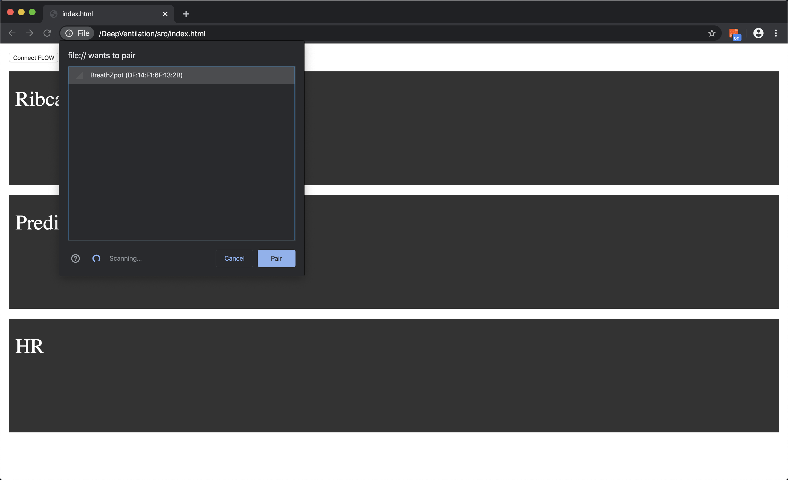

# DeepVentilation

This application connects to a SweetZpot FLOW breathing sensor using Bluetooth
Low Energy, and predicts airflow using a LSTM neural network model. 

## Requirements

Hardware:

* [SweetZpot FLOW breathing sensor](https://www.sweetzpot.com/flow) ([SweetZpot
  on Facebook](https://www.facebook.com/sweetzpot)).


Software:

* [Web Bluetooth supported browser](https://caniuse.com/#feat=web-bluetooth),
  for example [Google Chrome](https://www.google.com/chrome/).
* [Moesif Orign & CORS Changer browser
  plugin](https://chrome.google.com/webstore/detail/moesif-orign-cors-changer/digfbfaphojjndkpccljibejjbppifbc)
  or similar plugin that allows you to send cross-domain requests directly from
  browser without receiving Cross Origin Errors.
* Python 3, with the following modules:
    - `torch`
    - `flask`
    - `numpy`
    - `joblib`
    - `scikit-learn`


## Usage

1. Strap the FLOW sensor around your chest, just below your chest muscles. The
   sensor may be worn on top of clothing, but the clothes should not be too thick,
   to make sure the sensor closely matches the movement of your ribcage. The
   length of the belt can be adjusted, such that it sits comfortably around your
   chest without gliding down during movement. It should not be too tight; you
   should be able to breath freely without constriction. **NB:** Be sure to wear
   the belt before you connect it to the web app, otherwise the data will not be
   scaled correctly.
2. Start the airflow prediction app by running `python app.py` in a terminal
   from the `src` directory.
3. Make sure that the Moesif CORS plugin (or similar plugin) is switched on, and
   that your browser supports Web Bluetooth (for example Google Chrome).
4. Open `index.html` in your browser.


5. Click **Connect FLOW**.
6. Wait for the FLOW sensor to appear as "BreathZpot". In some cases this may
   take up to 30 seconds. If it does not appear, this might indicate that the
   FLOW sensor needs a new battery.



7. Select the FLOW (BreathZpot) sensor when it appears, and click **Pair**.
8. After 3-8 seconds, the web app starts receiving data from the sensor, and the
   real time graph of the ribcage movement is shown.
9. After 5 seconds of FLOW sensor data is sampled, the airflow prediction
   begins, and shows a real time graph.
10. To sample heart rate data (optional), wear a heart rate sensor just below
    the chest muscles next to the skin. Click **Connect HR**, and pair the
    sensor as described above. 

The real time graphs will automatically scale based on the maximum and minimum
values obtained.


### Troubleshooting

If you experience trouble with connecting the sensor, or the web app does not
visualize any data, you could try:

- Reload the page (`index.html`), and try to reconnect to sensor(s).
- Open the JavaScript console in the browser (in Google Chrome: View ->
  Developer -> Javascript Console). Any error messages will appear here.
- Double check that the script `app.py` is running in the background. When
  running the script, you should get a printout that includes:

  ```
  Breath scaler load successfully
  Airflow scaler load successfully
  LSTM load successfully
  ```

- Double check that the Moesif Orign & CORS Changer browser plugin is turned on.

